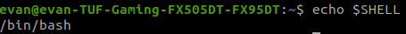
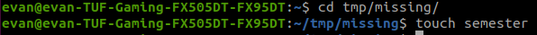
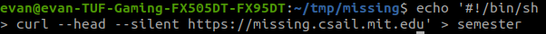
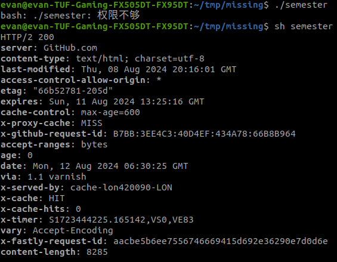
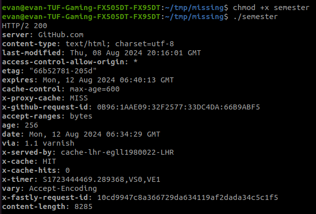
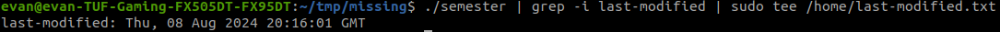
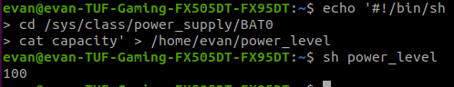

# P1  
## Task1  
### 1  
  
命令行程序在此电脑上的路径    
### 2  
  
create a new directory called missing under /tmp  
### 3-4  
  
在tmp/missing下创建文件 名为semester  
### 5  
  
将‘’内的内容写入semester文件中，用
### 6-7  
  
sh 可以执行 ./不能执行  因为sh命令不需要文件执行权限 ./命令需要文件执行权限
### 8-9  
  
给semester开放了执行权限，./命令就能使用  
### 10  
  
将semester的输出中last-modified一行输入到home目录中last-modified.txt文件中  
### 11  
  
将查看电量参数程序写入power_level文件中并执行  

## Task4
