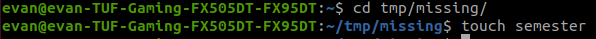

# Task1  
## 1  
  
命令行程序在此电脑上的路径   
```
echo $SHELL
```
## 2  
  
```
mkdir -p tmp/missing
```
create a new directory called missing under /tmp  
## 3-4  
  
```
touch semester
```
在tmp/missing下创建文件 名为semester  
## 5  
  
```
echo '#!/bin/sh 
> curl --head --silent https://missing.csail.mit.edu' > semester
```
将‘ ’内的内容写入semester文件中
## 6-7  
  
```
./semester
sh semester
```
sh 可以执行 ./不能执行  因为sh命令不需要文件执行权限 ./命令需要文件执行权限
## 8-9  
  
```
chomod +x semester
./semester
```
给semester开放了执行权限，./命令就能使用  
## 10  
  
```
./semester | grep -i last-modified | sudo tee /home/last-modified.txt
```
将semester的输出中last-modified一行输入到home目录中last-modified.txt文件中  
## 11  
  
```
echo '#!/bin/sh 
> cd /sys/class/power_supply/BAT0 
> cat capacity' > /home/evan/power_level
sh power_level
```
将查看电量参数程序写入power_level文件中并执行  

