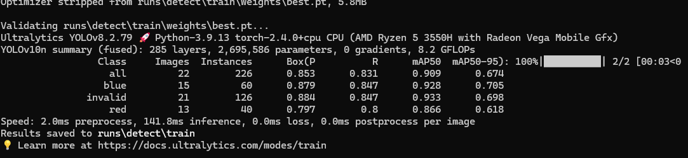

# 用YOLOv10训练图片
## 1
创建python虚拟环境
激活虚拟环境
```
python -m venv venv
call venv\Scripts\activate
```
## 2
安装相关依赖包和yolov10
```
pip install supervision labelme  labelme2yolo huggingface_hub google_cloud_audit_log
pip install torch torchvision torchaudio --index-url https://download.pytorch.org/whl/cu118
pip install git+https://github.com/THU-MIG/yolov10.git
```
## 3 
下载模型文件，这里选择yolov10n.pt
训练速度快，模型小。
## 4
使用roboflow标注图片，使用yolov8格式，解压好放进11文件夹中
## 5
修改data.yaml文件
将其中test，train，valid改为绝对路径
在本人电脑上为
```
train: E:/cyt files/P4/11/train/images
val: E:/cyt files/P4/11/valid/images
test: E:/cyt files/P4/11/test/images
```
## 6
命令行输入
```
yolo detect train data=11/data.yaml model=yolov10n.pt epochs=30 batch=8 imgsz=640
```
训练完毕

保存在runs\detect\train中
