# 自定义消息的发布订阅
## 1
新建工作空间
```
mkdir -p p3_ws/src
cd p3_ws
catkin_make
code . //打开vscode
```
# 2
预编译
调整task.json文件
```
{
	// 有关 tasks.json 格式的文档，请参见
		// https://go.microsoft.com/fwlink/?LinkId=733558
		"version": "2.0.0",
		"tasks": [
			{
				"label": "catkin_make:debug", //代表提示的描述性信息
				"type": "shell",  //可以选择shell或者process,如果是shell代码是在shell里面运行一个命令，如果是process代表作为一个进程来运行
				"command": "catkin_make",//这个是我们需要运行的命令
				"args": [],//如果需要在命令后面加一些后缀，可以写在这里，比如-DCATKIN_WHITELIST_PACKAGES=“pac1;pac2”
				"group": {"kind":"build","isDefault":true},
				"presentation": {
					"reveal": "always"//可选always或者silence，代表是否输出信息
				},
				"problemMatcher": "$msCompile"
			}
		]
	}

```	
# 3 
在/src目录下新建功能包assignment  
依赖：roscpp rospy std_msgs  
# 4
在功能包下新建msg文件夹，新建dd.msg 
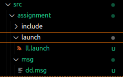
文件内容：
```
int64 x
int64 y
int64 z
```
# 5
编辑package.xml
添加
```
<build_depend>message_generation</build_depend> 
<exec_depend>message_runtime</exec_depend>
```
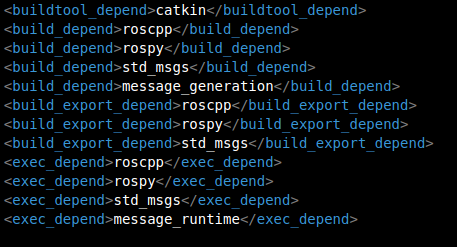
# 6 
编辑功能包下的CMakeLists.txt
```
find_package(catkin REQUIRED COMPONENTS
  roscpp
  rospy
  std_msgs
  message_generation
)
```
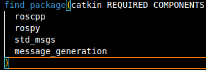
```
# Generate messages in the 'msg' folder
add_message_files(
  FILES
  dd.msg
)
```
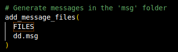
```
generate_messages(
  DEPENDENCIES
  std_msgs
)
```
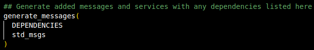
```
catkin_package(
#  INCLUDE_DIRS include
#  LIBRARIES assignment
 CATKIN_DEPENDS roscpp rospy std_msgs message_runtime
#  DEPENDS system_lib
)
```
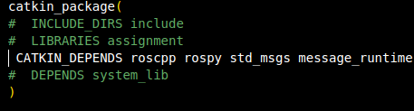

然后编译 
# 7
在p3_ws/devel下找到include
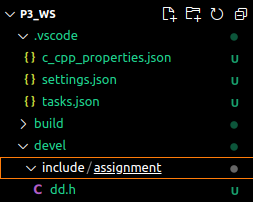
复制路径在c_cpp_properties.json文件中添加 
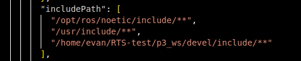
include/**表示包含include下所有文件
# 8
在功能包下src中新建文件talker.cpp作为发布者 
## 8.1 
包含ros和自定义消息的头文件
```
#include "ros/ros.h"
#include "assignment/dd.h"
```
## 8.2
进入main函数，将括号内*argv默认的const去掉
## 8.3
解决中文乱码问题
```
setlocale(LC_ALL,"");
```
节点初始化，命名为talker
```
ros::init(argc,argv,"talker");
```
创建节点句柄
```
ros::NodeHandle nh;
```
## 8.4
创建发布者对象，定义发布消息类型为assignment::dd,定义话题名称为"chat"，最大存储10次已发布的消息
```
ros::Publisher pub = nh.advertise<assignment::dd>("chat",10);
```
## 8.5
新建消息
设置消息中参数的值
```
assignment::dd msg;
    msg.x = 111;
    msg.y = 111;
    msg.z = 232;
```
## 8.6
设置发布频率为一秒一次并循环发布
```
ros::Rate r(1);
    while (ros::ok())
    {
        pub.publish(msg);
        r.sleep();
        ros::spinOnce();
    }
```
## 8.7 最终效果
```
#include "ros/ros.h"
#include "assignment/dd.h"

int main(int argc, char  *argv[])
{
    setlocale(LC_ALL,"");
    ros::init(argc,argv,"talker");
    ros::NodeHandle nh;
    ros::Publisher pub = nh.advertise<assignment::dd>("chat",10);
    assignment::dd msg;
    msg.x = 111;
    msg.y = 111;
    msg.z = 232;

    ros::Rate r(1);
    while (ros::ok())
    {
        pub.publish(msg);
        r.sleep();
        ros::spinOnce();
    }
    
    return 0;
}
```
# 9
在功能包下src中新建文件listener.cpp作为订阅者 
## 9.1
包含头文件
```
#include "ros/ros.h"
#include "assignment/dd.h"
```
## 9.2
声明并写出处理消息的函数：接到消息后打印每个值
```
void domsg(const assignment::dd::ConstPtr& Msg){
    ROS_INFO("x:%d y:%d z:%d",Msg->x,Msg->y,Msg->z);
}
```
## 9.3
进入main函数，并将*argv前的const去掉
## 9.4
初始化节点，命名为listener
```
ros::init(argc,argv,"listener");
```
创建节点句柄
```
ros::NodeHandle nh;
```
## 9.5
创建订阅者对象，订阅消息类型为assignment：：dd，订阅话题为"chat",最大存储10次已发布的消息，处理函数为domsg
```
ros::Subscriber sub = nh.subscribe<assignment::dd>("chat",10,domsg);
```
## 9.6
循环订阅
```
ros::spin();
```
## 9.7 最终效果
```
#include "ros/ros.h"
#include "assignment/dd.h"


void domsg(const assignment::dd::ConstPtr& Msg){
    ROS_INFO("x:%d y:%d z:%d",Msg->x,Msg->y,Msg->z);
}


int main(int argc, char  *argv[])
{
    ros::init(argc,argv,"listener");
    ros::NodeHandle nh;
    ros::Subscriber sub = nh.subscribe<assignment::dd>("chat",10,domsg);

    ros::spin();

    return 0;
}
```
# 10
编辑功能包下的CMakeLists.txt
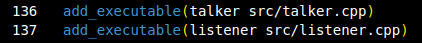
```
add_executable(talker src/talker.cpp)
add_executable(listener src/listener.cpp)
```
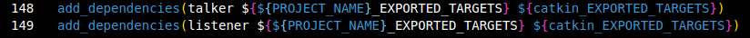
```
add_dependencies(talker ${${PROJECT_NAME}_EXPORTED_TARGETS} ${catkin_EXPORTED_TARGETS})
add_dependencies(listener ${${PROJECT_NAME}_EXPORTED_TARGETS} ${catkin_EXPORTED_TARGETS})
```
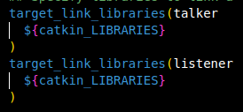
```
target_link_libraries(talker
  ${catkin_LIBRARIES}
)
target_link_libraries(listener
  ${catkin_LIBRARIES}
)
```
编译
# 11
在功能包下创建launch文件夹，新建ll.launch文件
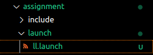
```
<launch>
    <node pkg="assignment" type="talker" name="talker"/>
    <node pkg="assignment" type="listener" name="listener" output="screen"/>
</launch>
```
pkg:功能包名 
type:文件名 
name:节点名
output:输出端
然后编译
# 12 最终执行
打开两个终端
## 12.1
roscore启动核心
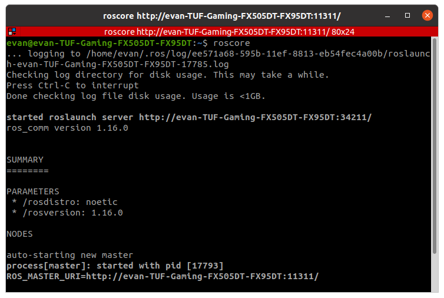
## 12.2
更新环境变量
roslaunch启动两个节点
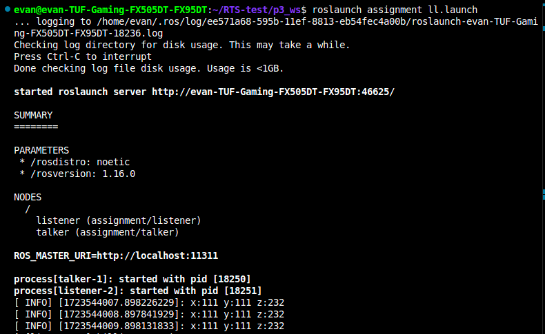
```
source ./devel/setup.bash 
roslaunch assignment ll.launch
```